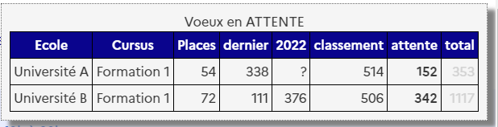

# ParcourSimple
[GreaseMonkey](https://addons.mozilla.org/en-US/firefox/addon/greasemonkey/) / [TamperMonkey](https://www.tampermonkey.net/index.php) script pour simplifier la lecture des voeux en attente sur ParcourSup

Une image valant 1000 mots, plutôt que de devoir cliquer sur chaque vœu, puis de déchiffrer le paragraphe textuel,
ce script vous affiche un tableau avec l'ensemble de vos vœux en attente : 

Voici ce que cela donne sur la page principae de ParcourSup. 

Ça ne vous donnera pas vos vœux positifs, mais déjà, c'est cool non ? 

# Installation 

## Via GreasyFork

Allez sur https://greasyfork.org/fr/scripts/467772-parcoursimple et tout est expliqué pour installer l'extension TamperMonkey puis le script s'installe en 1 click.

