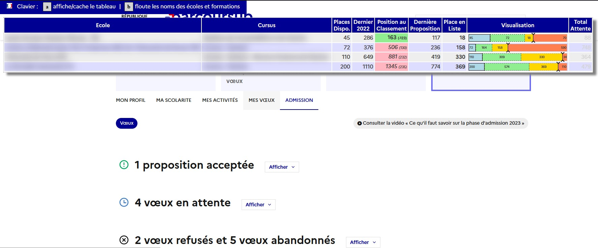

# ParcourSimple
[GreaseMonkey](https://addons.mozilla.org/en-US/firefox/addon/greasemonkey/) / [TamperMonkey](https://www.tampermonkey.net/index.php) script pour simplifier la lecture des voeux en attente sur ParcourSup

Une image valant 1000 mots, plutôt que de devoir cliquer sur chaque vœu, puis de déchiffrer le paragraphe textuel,
ce script vous affiche un tableau avec l'ensemble de vos vœux en attente : 

Le script ajoute un menu indiquant des raccourcis clavier aussi : 

 - `a` pour cacher / Afficher le tableau.
- `b` pour masquer les noms des ecols/formatins dans le tableau si vous voulez screen/record anonymement

Voici ce que cela donne sur la page principale de ParcourSup. 

## Explications de l'indicateur graphique

- La partie bleue correspond aux places de la formation visée (elle ne bouge pas) : 45
- La partie verte correspond aux personnes ayant reçu une proposition, c'est la place au classement de la dernière personne avoir reçu une porposition moins le nombre de places de la formation. Ici l'exemple montre 72 = 117 - 45.
- la partie jaune montre le nombre de personnes restant en liste d'attente jusqu'à vous : 18
- Votre position est matérialisé par les chevrons verticaux entre le jaune et le rouge.
- Enfin la partie rouge matérialise les personnes en liste d'attente derrière vous. C'est la différence entre le total de la liste d'attente et votre position en liste d'attente : 70 = 88 - 18.

Ça ne vous donnera pas vos vœux positifs, mais déjà, c'est cool non ? 

# Installation 

## Via GreasyFork

Allez sur https://greasyfork.org/fr/scripts/467772-parcoursimple et tout est expliqué pour installer l'extension TamperMonkey puis le script s'installe en 1 click.

# Autre script 

J'ai créé un autre script permettant de cacher les informations personnelles a l'écran pour pouvoir faire des captures d'écran ou filmer sans divulguer de choses sensibles sur les réseaux sociaux.

https://greasyfork.org/en/scripts/468116-parcoursup-obfuscate

