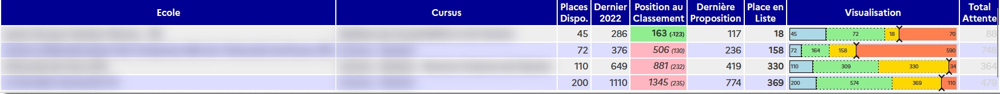

# ParcourSimple
[GreaseMonkey](https://addons.mozilla.org/en-US/firefox/addon/greasemonkey/) / [TamperMonkey](https://www.tampermonkey.net/index.php) script pour simplifier la lecture des voeux en attente sur ParcourSup

Une image valant 1000 mots, plutôt que de devoir cliquer sur chaque vœu, puis de déchiffrer le paragraphe textuel,
ce script vous affiche un tableau avec l'ensemble de vos vœux en attente : 

Le script ajoute un menu indiquant des raccourcis clavier aussi : 

 - `a` pour cacher / Afficher le tableau.
 - `r` pour trier par placement dans la liste d'attente (par défaut).
 - `t` pour trier par progression relative dans la liste d'attente.

La position relative donne une idée de si l'on se rapproche d'une proposition ou pas. Selon les formations le nombre de places disponibles, et les désistements ne sont pas les memes et se baser sur son placement en liste d'attente peut fausser la perception.
Exemple, une formation avec 50 places si on est 150eme en attente ca n'a pas la meme signification qu'une formation a 350 places.
On peut aussi avoir des formations ou il y a beaucoup de desistements et d'autres peu.

Il y a 2 autres raccourcis cachés : 

- `b` pour masquer les noms des ecols/formatins dans le tableau si vous voulez screen/record anonymement
- `t` pour afficher le nombre de personnes restant en liste d'attente

Voici ce que cela donne sur la page principale de ParcourSup. 

Ça ne vous donnera pas vos vœux positifs, mais déjà, c'est cool non ? 

# Installation 

## Via GreasyFork

Allez sur https://greasyfork.org/fr/scripts/467772-parcoursimple et tout est expliqué pour installer l'extension TamperMonkey puis le script s'installe en 1 click.

# Autre script 

J'ai créé un autre script permettant de cacher les informations personnelles a l'écran pour pouvoir faire des captures d'écran ou filmer sans divulguer de choses sensibles sur les réseaux sociaux.

https://greasyfork.org/en/scripts/468116-parcoursup-obfuscate

